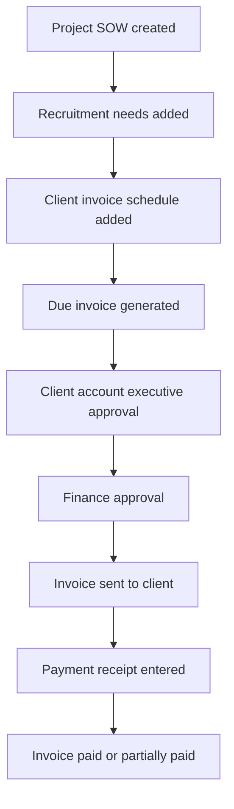

# Database And Data Structures

The database is owned only by this application. It does not share tables, users, or database services with the FlexGCC execution system.

## Implemented In Flow 1

- `app_users`: independent users for operations, HR, internal interviewers, finance, client account executives, and job candidates.
- `client_companies`: client legal/company records.
- `client_contacts`: client contact people used for SOWs and invoice communication.
- `master_service_agreements`: MSA records that can group multiple SOWs.
- `project_sows`: project records. Each SOW gets its own project code.
- `uploaded_documents`: metadata for MSA, SOW, contract, invoice, and receipt uploads.
- `recruitment_needs`: position requirements for a project.
- `client_invoice_schedules`: single or recurring invoicing schedules for a project.
- `client_invoices`: generated invoices created from schedules.
- `client_invoice_approvals`: approvals by client account executives and finance managers.
- `client_payments`: payment receipt records and collection status.
- `email_notifications`: auditable records for system-generated reminder/send actions.
- `activity_logs`: timeline events.

## Reserved For Later Flows

- `candidates`: candidate profiles entered into the recruitment pipeline.
- `candidate_screening_forms`: generated pre-interview forms.
- `candidate_evaluations`: scored candidate form results.
- `interviews`: internal interview events.
- `interview_scorecards`: internal interviewer recommendations.
- `candidate_contracts`: final candidate/consultant contract records.
- `candidate_vendor_invoices`: candidate or fractional consultant invoices.
- `candidate_invoice_approvals`: client account executive approvals for candidate invoices.
- `candidate_payments`: payments made to candidates or consultants.
- `agent_tasks`: manual or scheduled AI-agent tasks from the diagram.

## Project To Collection State Flow

